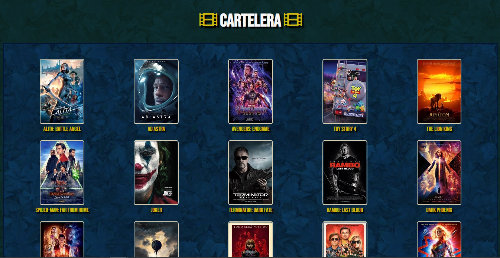
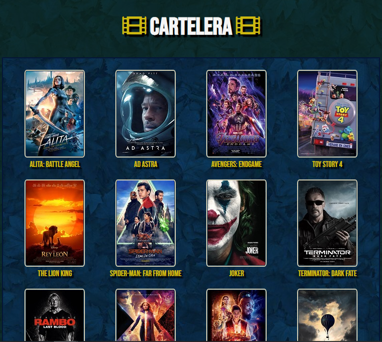

# INDEX 📋

- **Cinema** 🎦
  - [**About project**](#about-project) ⭐
  - [**Preview**](#preview) 🔍
  - [**Screenshots**](#screenshots) 📷
  - [**Technologies**](#technologies) 💻
  - [**Setup**](#setup) 🔧
  - [**Usage**](#usage) 📋
  - [**Status**](#status) ⚪
  - [**Contact**](#contact) 📞


# About project⭐


**Date**: October, 2019.   
**Duration**: 2 Days.


This project was developted in order to practice with **CSS Grid**.
But it also has **HTML** and **JavaScript** to make it works correctly.

# Preview🔍

[💠You can try it!💠](https://hukex.github.io/Cinema/)

 
</p>

# Screenshots📷

>
>
>


# Technologies💻

- **HTML**
- **CSS**
- **JavaScript**


# Setup🔧

*You are lucky* 😃 *it doesn't need installation. Just clone this repository and enjoy it.*

```bash
git clone https://github.com/Hukex/Cinema.git
```

# Usage📋

Basically the main page (index) is **index.html** just double click on the file and it will open on your predeterminated browser.
Now you can enjoy it.


# Status⚪

**Finished.**

It was for practice so it's done.

# Contact📞

My name is Fernando, you can contact me if you desire!


## 😃 Thanks for reading. 👋

